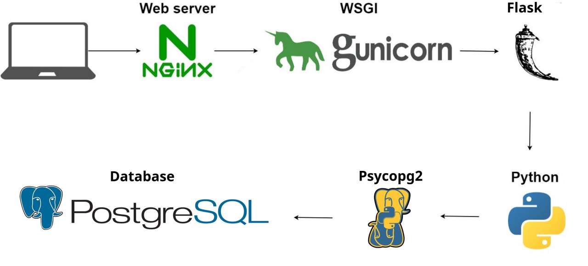

## More Tech 4.0 Backend

## Инструкция по запуску
### Требования

- Linux (Ubuntu)
- Python 3.5+
- PostgreSQL

### Установка
Введите в `psql`:

```
CREATE DATABASE more_tech4;
```

Введите в терминале:

```
sudo apt update && sudo apt -y dist-upgrade
sudo apt install -y git python3-venv libpq-dev gcc postgresql
git clone https://github.com/vahellame/more_tech4_backend.git
cd more_tech4_backend
python3 -m venv venv
./venv/bin/pip install -U pip wheel
./venv/bin/pip install -r requirements.txt
PYTHONPATH=$PWD ./venv/bin/python common/init.py
```


### Настройка

Просмотрите и отредактируйте файлы:
- `src/config.py`
- `common/mt-backend.service`

Введите в терминале:
```
sudo cat common/mt-backend.service > /usr/lib/systemd/system/mt-backend.service
sudo systemctl daemon-reload
sudo systemctl enable mt-backend.service
sudo systemctl start mt-backend.service
```

## Архитектура и стек



- В папке `common` лежат файлы, необходимые для запуска проекта и mock данные
- В папке `src/methods` лежат методы, которые определены в app.py
- В папке `src/utils` лежат утилиты проекта